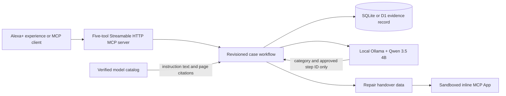

# FixProof

A voice-first Alexa+ experience and MCP server for the Amazon Developer Hackathon 2026. FixProof carries a dishwasher issue through source-linked checks, explicit user outcomes and a repair handover. It is an independent prototype, not a manufacturer service.

## Try the hosted workflow

Open [the public FixProof evaluation build](https://fixproof-alexa.keyvan-andayesh.chatgpt.site). It uses a fixed source-backed sequence and browser storage so an appliance owner or repair professional can test the core workflow without installing anything. The same page can export and independently verify a handover JSON file entirely in the browser, including changed-field detection and the explicit no-authorship boundary. Judges can also call the [public Streamable HTTP MCP endpoint](https://fixproof-mcp.keyvan-andayesh.chatgpt.site/) directly; its landing page includes a zero-setup live proof that negotiates the protocol, discovers the five tools and MCP App, runs a fixed fictional cited check, reads the saved outcome back and prepares the fingerprinted handover. The endpoint accepts fictional demonstration cases only and persists its workflow in D1. The evaluation page also embeds a captioned 2:38 walkthrough of all nine source-backed paths and the controlled retrieval result with natural Australian neural narration.

## 90-second judge tour

1. Read the impact card, choose a verified Bosch reference model, then start a fictional drying case. The selector also exposes separate food-remnant, detergent-residue, removable-streak, wash-noise, cutlery-rust, irreversible-glass-clouding, unpleasant-interior-odour and door-related-starting paths.
2. Ask **What should I check first?** and open the cited manual page.
3. Save **Issue unchanged** with the observation **Waited 30 minutes; glasses remained wet.**
4. Reload the page, resume the saved case, and ask **What should I check next?** The recorded check is excluded.
5. Preview the handover, download its evidence JSON, then open **Verify evidence JSON** and paste or choose the file. Confirm that the recomputed fingerprint matches and the bounded case facts remain readable.
6. Change one evidence field in a copy and verify that the receiver reports a fingerprint mismatch, then use the scenario shortcuts to inspect the plastic, safety, unsupported-issue, and unclear-report boundaries.

## Runtime architecture



The model classifies the symptom and selects only from server-provided remaining check IDs. Application code supplies every instruction and citation. A user action is the only path that records an outcome.

## Evidence map

| Claim | Reproducible evidence |
| --- | --- |
| Real MCP runtime | [Public callable endpoint](https://fixproof-mcp.keyvan-andayesh.chatgpt.site/), [captured hosted result](validation/HOSTED_MCP.json), executable `fixproof/hosted_mcp_smoke.py`, local [HTTP result](validation/RELIABILITY_MCP.json), and integration tests |
| State survives retries and reloads | SQLite, stable request IDs, case revisions, and automated stale-write tests |
| Suggestions do not become facts | `record_outcome` requires the current pending check and an explicit outcome |
| Sources are application-owned | `fixproof/catalog.py` owns exact-model provenance; MCP guidance returns exact page URLs and the verified content hash |
| Handover is composable | `prepare_handover` returns readable Markdown plus a versioned evidence object, a reproducible SHA-256 fingerprint over that object, and a sandboxed [`ui://` MCP App](fixproof/handover_app.html) for human review; the zero-install browser build exports the same evidence schema as JSON and locally verifies an unchanged or edited copy |
| Handover structure aids retrieval | [Controlled synthetic evaluation](validation/HANDOVER_RETRIEVAL_EVAL.md): 254/270 fields with zero critical errors from handovers versus 243/270 fields and five critical errors from equal-fact transcripts across three local model families and all nine issue paths |
| Boundaries are visible | Hazard, unsupported issue, unconfirmed model, and unclear-symptom cases |
| Potential-impact context | [Official-source evidence note](validation/IMPACT_EVIDENCE.md), with documented repair barriers separated from the product outcomes that still need measurement |
| Current judge walkthrough | Embedded captioned 2:38 video on the public evaluation page; [video QA and provenance](validation/VIDEO_V9_QA.md) |
| Developer feedback | [Hackathon friction log](FRICTION_LOG.md) |

The submission positioning for each judging criterion is documented in [the judging strategy](submission/JUDGING_STRATEGY.md).

## Run the local web experience on Windows

Requires Python 3.10+ and a running local Ollama instance with `qwen3.5:4b` already installed. The browser experience itself uses only the Python standard library and needs no cloud credentials.

```powershell
python fixproof/server.py
```

Open http://127.0.0.1:8768 and choose **Open demonstration case**. Ask for a check, open its source, record an outcome, reload, ask what is next and prepare a handover. The demonstration is fictional and does not establish appliance ownership or a successful repair.

If Ollama is unavailable, case creation, saved records and export still work. AI requests report failure and retain the draft. Start your local Ollama service and retry. Do not change another application's model configuration to run this project.

Optional environment variables: `FIXPROOF_MODEL`, `FIXPROOF_OLLAMA`, `FIXPROOF_PORT`, `FIXPROOF_DATA`. Defaults: `qwen3.5:4b`, `http://127.0.0.1:11434`, `8768`, `fixproof/data`. Keep the provider local unless remote data transfer and cost are approved. No model download is performed by the application.

## Run the MCP server

For immediate judge testing, open `https://fixproof-mcp.keyvan-andayesh.chatgpt.site` and choose **Run live MCP proof**, or connect an MCP client to `https://fixproof-mcp.keyvan-andayesh.chatgpt.site/api/mcp`. It runs the same bounded three-model, nine-path catalog as a separate public TypeScript MCP service with D1 continuity. The public `prepare_handover` tool advertises the same self-contained `ui://fixproof/handover.html` MCP App as the local server, with Markdown and structured JSON fallbacks. The public service rejects requests unless `fictional_demo: true` is supplied and must not receive real appliance or personal data.

The MCP endpoint uses the official Python SDK and Streamable HTTP. It exposes `start_case`, `read_case`, `ask_fixproof`, `record_outcome` and `prepare_handover` as one stateful agent workflow. The handover tool also exposes `ui://fixproof/handover.html` through the official MCP Apps extension, allowing a compatible host to render the evidence inside the conversation.

```powershell
python -m venv .venv
.\.venv\Scripts\python.exe -m pip install -r requirements.txt
.\.venv\Scripts\python.exe fixproof\mcp_server.py
```

Connect to `http://127.0.0.1:8771/mcp`. In another terminal, verify the transport and create a fictional case:

```powershell
.\.venv\Scripts\python.exe fixproof\mcp_smoke.py
```

The server defaults to loopback, uses the same SQLite record and bounded AI decisions as the browser experience, and rejects invalid browser origins through the SDK transport. `prepare_handover` returns readable Markdown and a versioned evidence object so another agent can consume the record without parsing prose. Compatible hosts can render the same result as a self-contained MCP App; clients without Apps support still receive the complete text and structured fallback. A public deployment needs HTTPS and authentication before accepting real case data.

## Implemented

- Three exact reference models, Bosch SMS6HAI02A/01, SMS6HCI01A/38 and SMS6HCI02A/72. The same twenty-nine application-owned checks across drying, food-remnant, detergent-residue, removable-streak, wash-noise, cutlery-rust, irreversible-glass-clouding, unpleasant-interior-odour and door-related-starting paths are independently mapped to visually checked pages in each model's official manual.
- Local AI classifies symptoms, then selects from remaining source-backed checks. Server supplies instruction text and citations. Unsupported/unconfirmed models do not receive model-specific checks.
- SQLite history, revision checks and request idempotency. Outcomes, deferred/skipped checks and user-reported resolution remain distinct. Explicitly revisit recorded outcomes to update them.
- Reload/resume, model traces, manufacturer links, handover preview, Markdown download and portable structured-JSON download. The public receiver accepts a file or pasted bundle, recomputes its fingerprint locally, rejects changed evidence and renders the bounded case facts without uploading the file.
- Optional Chrome speech input fills the question for review without submitting it. Browser speech output can read the latest FixProof response aloud. The typed path remains available throughout.
- Official MCP Python SDK 2.2.0 server over Streamable HTTP. The tested client negotiated MCP protocol `2026-07-28`, later than the competition's `2025-11-25` minimum. Supported step and informational results carry self-contained page citations plus the verified source hash.
- Public judge-callable TypeScript MCP SDK 2.0.0 deployment over Streamable HTTP, with D1-backed state across connections, an enforced fictional-only input boundary, and machine-facing server instructions that enumerate all nine verified paths.
- Versioned machine-readable handover evidence preserves the status, observation and citations for every recorded check alongside the human-readable Markdown. A SHA-256 fingerprint over canonical sorted JSON makes later field changes detectable; it is explicitly not an identity or authorship proof.
- MCP tool annotations identify read-only and state-changing operations, declare retry-safe idempotency, and tell clients that the tools do not reach into an open external world.
- The read-only handover tool declares an official MCP Apps `ui://` resource. Its self-contained interface loads no external assets, requests no device permissions, renders values through safe DOM text operations, and retains a meaningful result for text-only clients.
- Loopback binding, Host/Origin checks, bounded requests, parameterized SQL and no arbitrary source URL fetching.

## Verify

```powershell
.\.venv\Scripts\python.exe -m unittest discover -s fixproof -p "test*.py" -v
python fixproof/evaluate.py
python validation/evaluate_handover_retrieval.py
node --check fixproof/app.js
node --test validation/test_public_workflow.cjs
```

Live workflow evaluations use the local model and write `validation/LOCAL_AI_EVAL.json`. The controlled retrieval evaluation writes `validation/HANDOVER_RETRIEVAL_EVAL.json` and measures exact fact extraction from fictional equal-fact formats; it is not an automated test or human study. Tests use an isolated temporary database. See [QA evidence](validation/FIXPROOF_QA.md), [scope](validation/FIXPROOF.md) and the [public Devpost entry](https://devpost.com/software/fixproof).

## Boundaries

Local, single-user MVP: no authentication, encrypted storage, remote sharing, physical inspection, Alexa device execution or customer validation. Do not expose either development server publicly. AI can misclassify novel phrasing; the evaluated set is small. Twenty-nine checks across nine issue paths do not cover the whole manual or prove a repair is needed.

Chrome provides speech recognition and may use its online service; spoken transcripts can therefore leave the computer before FixProof receives them. The UI states this before the microphone control. Speech input never submits automatically. The microphone permission path has not been accepted or end-to-end tested; typed input and spoken playback were browser-tested.

Personal case data in `fixproof/data/` and reference downloads in `tmp/` are ignored. Do not publish these folders. Original brief summaries and source links are included, not a redistributed manual. The source is released under the MIT License.

The `dist/` folder is the transparent hosted evaluation build. It uses a fixed source-backed sequence and browser storage so external testers can assess the workflow without access to the local Ollama service. It identifies that limitation in the interface. FixProof was submitted to the Alexa+ track and Open Source Mini Challenge on 14 September 2026.

The revised browser flow keeps the question available while a check is pending. A hazard report cancels the pending check, stops troubleshooting, persists the warning, and includes the report in the handover. See [recorded verification](validation/VIDEO_V2_QA.md).

The reliability revision extends that stop to the real HTTP/MCP workflow and outcome observations, separates performed and deferred evidence, preserves pending checks through informational replies, avoids tested false stops for explicit no-hazard statements and technical phrases, returns self-contained citations in MCP guidance, exposes a versioned structured handover, and publishes client-planning annotations for every tool. A cross-connection test and real HTTP run verify that recorded evidence survives a new client and the recorded check is not suggested again. The latest breadth revision adds separately bounded food-remnant, detergent-residue, removable-streak, wash-noise, cutlery-rust, irreversible-glass-clouding, unpleasant-interior-odour and door-related-starting paths without mixing their evidence with drying cases. The current MCP Apps revision gives the handover a secure inline interface while preserving the same five-tool contract and text fallback. Its 31 Python regression tests, seventeen public-interface logic tests and eighteen live local-AI scenarios passed. See the [reliability review](validation/RELIABILITY_REVIEW.md) for exact evidence, limitations and release status. The lexical hazard preflight is conservative and incomplete; it is not a comprehensive safety detector.
