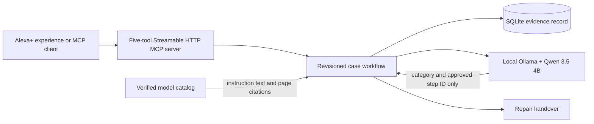

# FixProof

A voice-first Alexa+ experience and MCP server for the Amazon Developer Hackathon 2026. FixProof carries a dishwasher issue through source-linked checks, explicit user outcomes and a repair handover. It is an independent prototype, not a manufacturer service.

## Try the hosted workflow

Open [the public FixProof evaluation build](https://fixproof-alexa.keyvan-andayesh.chatgpt.site). It uses a fixed source-backed sequence and browser storage so an appliance owner or repair professional can test the core workflow without installing anything. The hosted interface states that it is a simulation and does not run the local AI implementation.

## 90-second judge tour

1. Start the fictional Bosch SMS6HAI02A/01 drying case.
2. Ask **What should I check first?** and open the cited manual page.
3. Save **Still wet** with the observation **Waited 30 minutes; glasses remained wet.**
4. Reload the page, resume the saved case, and ask **What should I check next?** The recorded check is excluded.
5. Preview the handover and confirm that it contains the observation, exact-model provenance, page-level source, and unresolved limits.
6. Use the scenario shortcuts to inspect the plastic, safety, unsupported-issue, and unclear-report boundaries.

## Runtime architecture



The model classifies the symptom and selects only from server-provided remaining check IDs. Application code supplies every instruction and citation. A user action is the only path that records an outcome.

## Evidence map

| Claim | Reproducible evidence |
| --- | --- |
| Real MCP runtime | [Captured HTTP result](validation/RELIABILITY_MCP.json), `fixproof/mcp_smoke.py`, and the MCP integration test |
| State survives retries and reloads | SQLite, stable request IDs, case revisions, and automated stale-write tests |
| Suggestions do not become facts | `record_outcome` requires the current pending check and an explicit outcome |
| Sources are application-owned | `fixproof/catalog.py` owns exact-model provenance; MCP guidance returns exact page URLs and the verified content hash |
| Handover is composable | `prepare_handover` returns readable Markdown plus a versioned evidence object with explicit check status and citations |
| Boundaries are visible | Hazard, unsupported issue, unconfirmed model, and unclear-symptom cases |
| Developer feedback | [Hackathon friction log](FRICTION_LOG.md) |

The submission positioning for each judging criterion is documented in [the judging strategy](submission/JUDGING_STRATEGY.md).

## Run the local web experience on Windows

Requires Python 3.10+ and a running local Ollama instance with `qwen3.5:4b` already installed. The browser experience itself uses only the Python standard library and needs no cloud credentials.

```powershell
python fixproof/server.py
```

Open http://127.0.0.1:8768 and choose **Open demonstration case**. Ask for a check, open its source, record an outcome, reload, ask what is next and prepare a handover. The demonstration is fictional and does not establish appliance ownership or a successful repair.

If Ollama is unavailable, case creation, saved records and export still work. AI requests report failure and retain the draft. Start your local Ollama service and retry. Do not change another application's model configuration to run this project.

Optional environment variables: `FIXPROOF_MODEL`, `FIXPROOF_OLLAMA`, `FIXPROOF_PORT`, `FIXPROOF_DATA`. Defaults: `qwen3.5:4b`, `http://127.0.0.1:11434`, `8768`, `fixproof/data`. Keep the provider local unless remote data transfer and cost are approved. No model download is performed by the application.

## Run the MCP server

The MCP endpoint uses the official Python SDK and Streamable HTTP. It exposes `start_case`, `read_case`, `ask_fixproof`, `record_outcome` and `prepare_handover` as one stateful agent workflow.

```powershell
python -m venv .venv
.\.venv\Scripts\python.exe -m pip install -r requirements.txt
.\.venv\Scripts\python.exe fixproof\mcp_server.py
```

Connect to `http://127.0.0.1:8771/mcp`. In another terminal, verify the transport and create a fictional case:

```powershell
.\.venv\Scripts\python.exe fixproof\mcp_smoke.py
```

The server defaults to loopback, uses the same SQLite record and bounded AI decisions as the browser experience, and rejects invalid browser origins through the SDK transport. `prepare_handover` returns both readable Markdown and a versioned evidence object so another agent can consume the record without parsing prose. A public deployment needs HTTPS and authentication before accepting real case data.

## Implemented

- Exact reference model Bosch SMS6HAI02A/01; manufacturer manual pages 23, 40 and 41 visually checked.
- Local AI classifies symptoms, then selects from remaining source-backed checks. Server supplies instruction text and citations. Unsupported/unconfirmed models do not receive model-specific checks.
- SQLite history, revision checks and request idempotency. Outcomes, deferred/skipped checks and user-reported resolution remain distinct. Explicitly revisit recorded outcomes to update them.
- Reload/resume, model traces, manufacturer links, handover preview and Markdown download.
- Optional Chrome speech input fills the question for review without submitting it. Browser speech output can read the latest FixProof response aloud. The typed path remains available throughout.
- Official MCP Python SDK 2.2.0 server over Streamable HTTP. The tested client negotiated MCP protocol `2026-07-28`, later than the competition's `2025-11-25` minimum. Supported step and informational results carry self-contained page citations plus the verified source hash.
- Versioned machine-readable handover evidence preserves the status, observation and citations for every recorded check alongside the human-readable Markdown.
- MCP tool annotations identify read-only and state-changing operations, declare retry-safe idempotency, and tell clients that the tools do not reach into an open external world.
- Loopback binding, Host/Origin checks, bounded requests, parameterized SQL and no arbitrary source URL fetching.

## Verify

```powershell
.\.venv\Scripts\python.exe -m unittest discover -s fixproof -p "test*.py" -v
python fixproof/evaluate.py
node --check fixproof/app.js
node --test validation/test_public_workflow.cjs
```

Live evaluations use the local model and write `validation/LOCAL_AI_EVAL.json`. Tests use an isolated temporary database. See [QA evidence](validation/FIXPROOF_QA.md), [scope](validation/FIXPROOF.md) and the [public Devpost entry](https://devpost.com/software/fixproof).

## Boundaries

Local, single-user MVP: no authentication, encrypted storage, remote sharing, physical inspection, Alexa device execution or customer validation. Do not expose either development server publicly. AI can misclassify novel phrasing; the evaluated set is small. Four checks do not cover the whole manual or prove a repair is needed.

Chrome provides speech recognition and may use its online service; spoken transcripts can therefore leave the computer before FixProof receives them. The UI states this before the microphone control. Speech input never submits automatically. The microphone permission path has not been accepted or end-to-end tested; typed input and spoken playback were browser-tested.

Personal case data in `fixproof/data/` and reference downloads in `tmp/` are ignored. Do not publish these folders. Original brief summaries and source links are included, not a redistributed manual. The source is released under the MIT License.

The `dist/` folder is the transparent hosted evaluation build. It uses a fixed source-backed sequence and browser storage so external testers can assess the workflow without access to the local Ollama service. It identifies that limitation in the interface. FixProof was submitted to the Alexa+ track and Open Source Mini Challenge on 14 September 2026.

The revised browser flow keeps the question available while a check is pending. A hazard report cancels the pending check, stops troubleshooting, persists the warning, and includes the report in the handover. See [recorded verification](validation/VIDEO_V2_QA.md).

The reliability revision extends that stop to the real HTTP/MCP workflow and outcome observations, separates performed and deferred evidence, preserves pending checks through informational replies, avoids tested false stops for explicit no-hazard statements and technical phrases, returns self-contained citations in MCP guidance, exposes a versioned structured handover, and publishes client-planning annotations for every tool. Its 21 Python regression tests, seven public-interface logic tests and ten live local-AI scenarios passed. See the [reliability review](validation/RELIABILITY_REVIEW.md) for exact evidence, limitations and release status. The lexical hazard preflight is conservative and incomplete; it is not a comprehensive safety detector.
